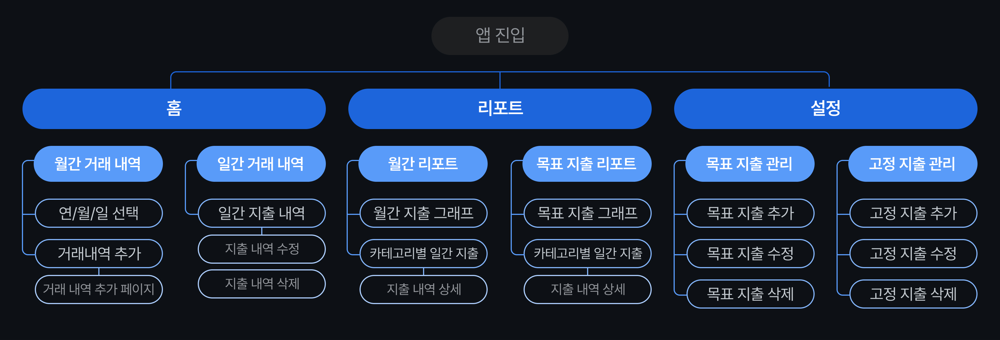
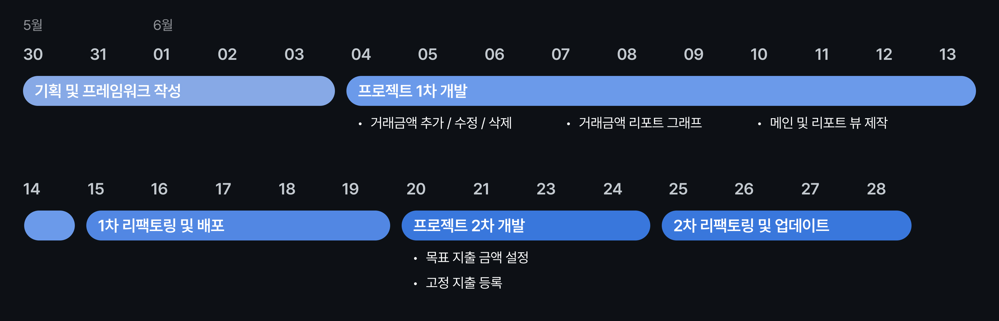

# 아껴쓸랩 &nbsp;&nbsp;  &nbsp;  &nbsp;  &nbsp;  
### 사용자의 지출 및 수입 금액을 관리하고, 거래 내역에 대한 리포트를 제공하는 가계부 앱입니다.

 

## 🧐 앱 목적
목적1. 지출 목표 금액을 설정해 사용자의 소비 습관 개선 
목적2. 월별 거래 내역에 대한 리포트를 제공해 소비 패턴 정보 제공
  

## 🧑🏻‍💻 팀원
|[조성빈](https://github.com/SeongbinJo)|[김혜림](https://github.com/Kimhyerimmm)|[이상민](https://github.com/rmfls0606)|
|-----------|-----------|-----------|
|||
 

## IA(정보구조도)

 

## 실행화면
| HomeView | CalendarView | ReportView | DetailReportView | CreateDataView |
|---------|--------|-------|--------|------|
|  |  |  |  |  |

 

## 메인 기능 구현

| 구현 완료 | 구현 미완료 |
| --- | --- |
| 지출 및 수입 내역 추가 | 고정 지출 자동 등록 |
| 거래 카테고리 월별 리포트 &nbsp; &nbsp; &nbsp; &nbsp; &nbsp; &nbsp; &nbsp; &nbsp; &nbsp; &nbsp; &nbsp; &nbsp; &nbsp; &nbsp; &nbsp; &nbsp; &nbsp; &nbsp; &nbsp; &nbsp; &nbsp; &nbsp; &nbsp; &nbsp; &nbsp; &nbsp; | 거래 카테고리별 목표 지출 금액 설정 &nbsp; &nbsp; &nbsp; &nbsp; &nbsp; &nbsp; &nbsp; &nbsp; &nbsp; &nbsp; &nbsp; &nbsp; &nbsp; &nbsp; &nbsp; &nbsp; &nbsp; &nbsp; &nbsp; |
| | 목표 지출 금액 리포트 |

  

## 일정

